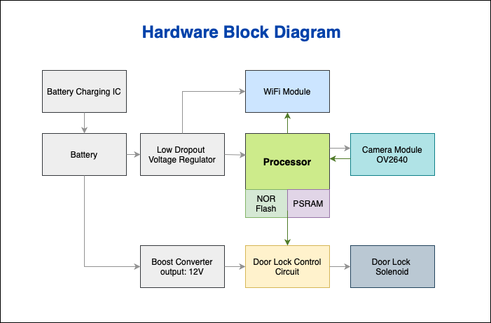

# Smart Face Recognition-Based Door Unlock System
This project implements a secure, AI-powered door unlock system using facial recognition. It captures an image using a camera module, sends it to a cloud server for processing, and unlocks the door if a known face is detected.

## System Overview

The system is composed of two major parts:

Hardware Node: Captures the image and receives unlock commands.  
Cloud Server: Processes the image using face detection and recognition.

  

## How It Works

1. The hardware captures an image when a person is in front of the door.
2. The image is sent to the Flask-based cloud server.
3. The server performs:
 a. Image Preprocessing
 b. Face Detection
 c. Face Recognition
4. If a known face is detected, the server sends a command to unlock the door.

## Hardware Block Diagram

The embedded system is built using a microcontroller with Wi-Fi, external memory, and a camera module (OV2640). Power is provided by a battery, with voltage regulation and a 12V boost converter for the solenoid lock.

  

