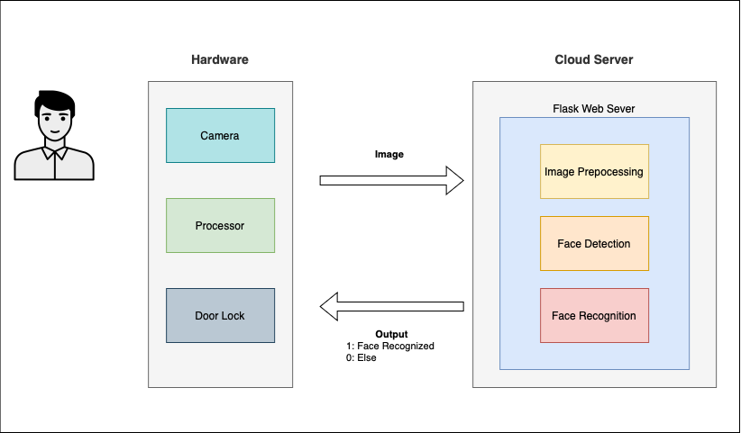

# Smart Face Recognition-Based Door Unlock System
This project implements a secure, AI-powered door unlock system using facial recognition. It captures an image using a camera module, sends it to a cloud server for processing, and unlocks the door if a known face is detected.

## System Overview

The system is composed of two major parts:

Hardware Node: Captures the image and receives unlock commands. \n
Cloud Server: Processes the image using face detection and recognition.

  

